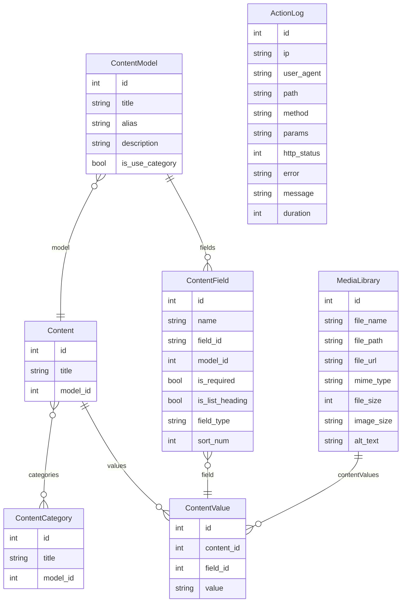

```mermaid
erDiagram
    ContentModel {
        int id
        string title
        string alias
        string description
        bool is_use_category
    }
    ContentField {
        int id
        string name
        string field_id
        int model_id
        bool is_required
        bool is_list_heading
        string field_type
        int sort_num
    }
    Content {
        int id
        string title
        int model_id
    }
    ContentCategory {
        int id
        string title
        int model_id
    }
    ContentValue {
        int id
        int content_id
        int field_id
        string value
    }
    MediaLibrary {
        int id
        string file_name
        string file_path
        string file_url
        string mime_type
        int file_size
        string image_size
        string alt_text
    }
    ActionLog {
        int id
        string ip
        string user_agent
        string path
        string method
        string params
        int http_status
        string error
        string message
        int duration
    }

    ContentModel ||--o{ ContentField : "fields"
    ContentModel }o--|| Content : "model"
    ContentField }o--|| ContentValue : "field"
    Content ||--o{ ContentValue : "values"
    Content }o--o{ ContentCategory : "categories"
    MediaLibrary ||--o{ ContentValue : "contentValues"
```